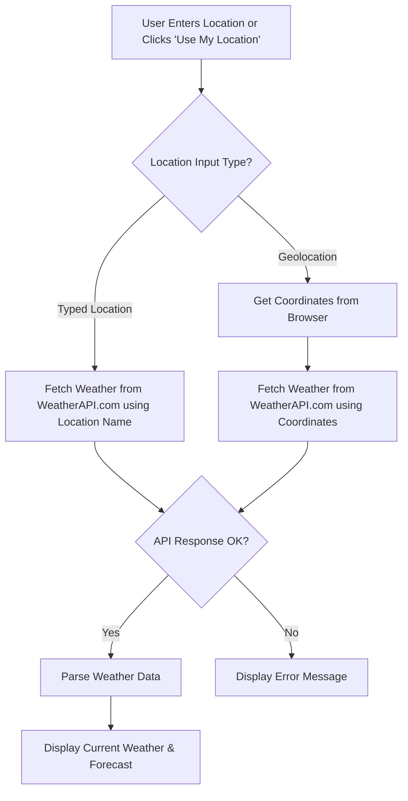

# WeatherWise: Your Friendly Weather Companion

WeatherWise is a simple and elegant web application that provides current weather conditions and a 5-day forecast for any location you search for. You can also use your current location to get instant weather updates.

## How It Works

The application follows a straightforward flow:

1.  **User Input**: The user can either type a location (city name or zip code) into the search bar or click the "Use My Location" button.
2.  **API Request**:
    *   If a location is typed, the app sends this location query to WeatherAPI.com.
    *   If "Use My Location" is clicked, the browser attempts to get the user's current geographical coordinates (latitude and longitude). These coordinates are then sent to WeatherAPI.com.
3.  **API Response**: WeatherAPI.com processes the request and returns:
    *   Current weather data (temperature, conditions, humidity, wind, etc.).
    *   A 5-day weather forecast.
4.  **Data Display**: The application parses the API response and updates the UI to display:
    *   A detailed card for the current weather.
    *   A series of cards for the 5-day forecast.
5.  **Error Handling**: If the location is not found or an API error occurs, a user-friendly error message is displayed.

### Workflow Diagram (Mermaid)



## Technology Stack

This project is built with a modern web development stack:

*   **Next.js**: A React framework for building server-rendered and statically generated web applications. We use the App Router and Server Components by default.
*   **React**: A JavaScript library for building user interfaces.
*   **TypeScript**: A superset of JavaScript that adds static typing for better code quality and maintainability.
*   **Tailwind CSS**: A utility-first CSS framework for rapid UI development.
*   **ShadCN UI**: A collection of re-usable UI components built with Radix UI and Tailwind CSS, providing a consistent and accessible design system.
*   **Lucide React**: A library for beautiful and consistent icons.
*   **WeatherAPI.com**: Used as the external API to fetch real-time weather data.


## Key Features

*   Search for weather by city name or zip code.
*   Get weather for your current location using browser geolocation.
*   Display current weather conditions: temperature, feels like, humidity, wind speed, pressure, visibility, sunrise/sunset times, and a descriptive icon.
*   Show a 5-day weather forecast with high/low temperatures, conditions, and icons.
*   Responsive design that works on desktop and mobile devices.
*   User-friendly error notifications.

## Getting Started

This project was bootstrapped in Firebase Studio.

1.  **Prerequisites**: Ensure you have Node.js and npm (or yarn) installed.
2.  **API Key**: The application uses WeatherAPI.com. The API key is currently included in `src/lib/weather-api.ts`. For production, you should move this to an environment variable (e.g., `.env.local` as `NEXT_PUBLIC_WEATHER_API_KEY`).
3.  **Running Locally**:
    ```bash
    npm install
    npm run dev
    ```
    Open [http://localhost:9002](http://localhost:9002) (or the port specified in your `package.json`) to view it in your browser.

## Credits

This application was created by:

*   **S. Likhitha**
*   Department of Computer Science and Engineering (CSE)
*   MVGR College of Engineering

Built with Firebase Studio.
